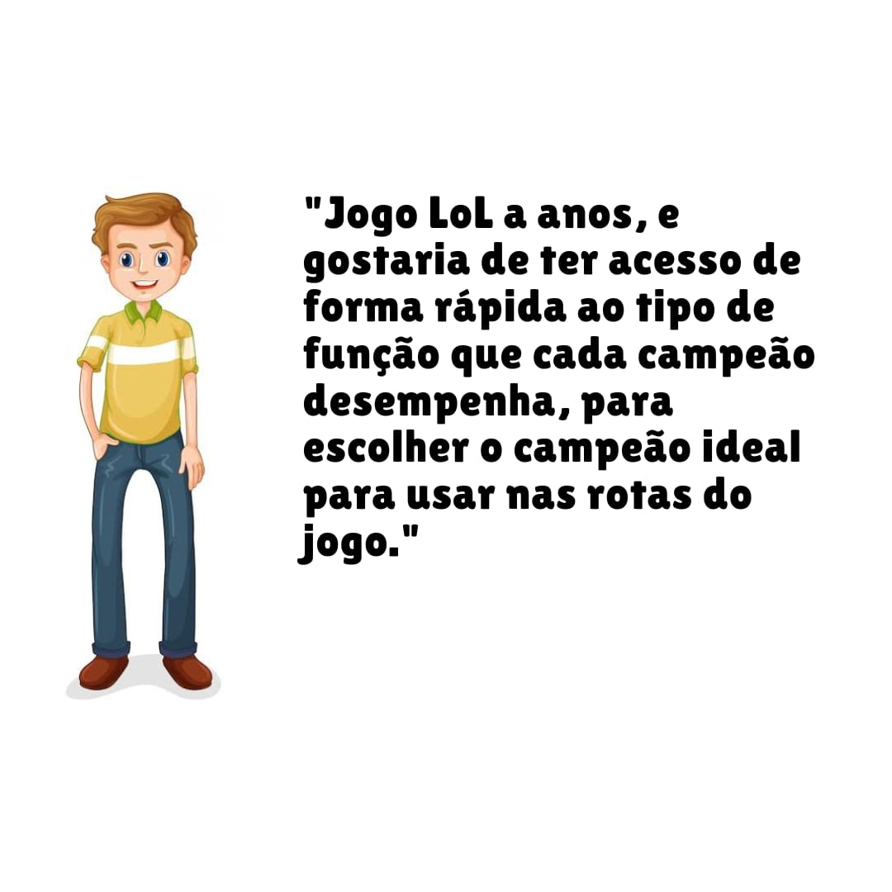
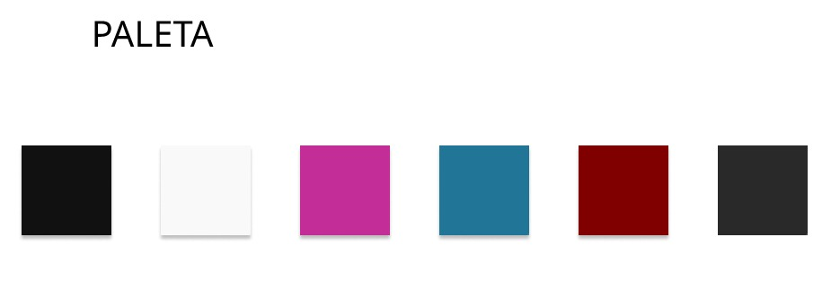
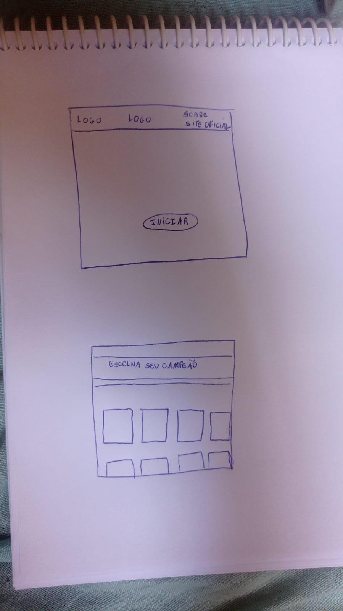
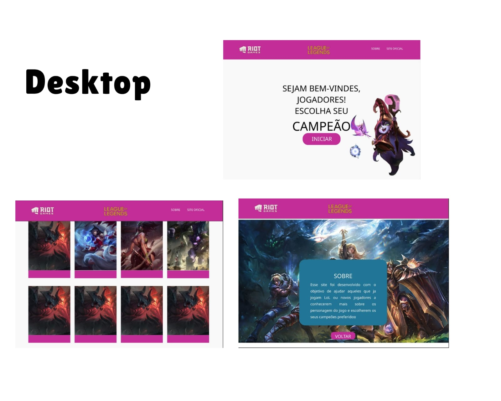
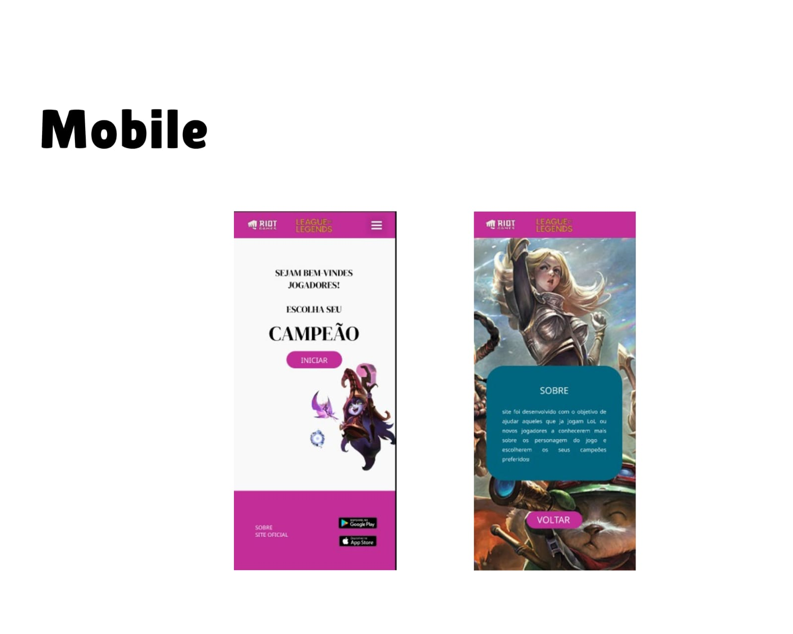

# Data Lovers

## Índice

* [1. Introdução](#1-introdução)
* [2. Objetivo do projeto](#2-objetivo-do-projeto)
* [3. O problema vs A solução](#3-o-problema-vs-a-solução)
* [4. Usuários](#4-usuários)
* [5. Protótipos](#5-prototipos)
* [6. Objetivos de aprendizagem](#6-objetivos-de-aprendizagem)
* [7. Testes de Usabilidade](#7-testes-de-usabilidade)
* [8. Linguagens utilizadas](#8-linguagens-utilizadas)

***

## 1. Introdução

League of legends (LoL), segundo o próprio site oficial, é um jogo de estratégia onde 
duas equipes com 5 campeões se enfrentam, com o objetivo de destruir a base uma da outra.
É um jogo online, que foi desenvolvido pela Riot games, lançado em 2019, e é jogado por 
mais de 8 milhões de pessoas no mundo.
Pensando nas necessidades dos jogadores de LoL, esse projeto foi desenvolvido, trazendo
informações sobre os campeões do jogo utilizando um banco de dados. 

## 2. Objetivo do projeto

O site sobre campeõess LoL foi criado com o objetivo de ajudar aqueles que já jogam
LoL a conhecerem melhor os campeões e montarem suas estratégias de jogo com base nas
infoirmações fornecida no site. Também tem como objetivo ajudar aqueles que estão 
começando no universo LoL a conhecerem cada um dos campeões do jogo.
O site apresenta cards com foto, nome e descriçoes como magia,
nível de dificuldade, ataque e defesa de cada campeão. Além disso, é possível
buscar pelos campeões que o usuário deseja utilizando os filtros de nível de 
dificuldade e função de cada campeão. 

## 3. O problema vs a solução

O jogo league of legends possui mais de 140 campeões. Assim, é muito díficil para
os usuários (especialmente os novos), conhecerem as habilidades de todos os campeões. 
Pensando nisso, este guia foi elaborado, para que de forma fácil os usuários possam
ter acesso a informações relevantes sobre os personagens do jogo.

## 4. Histórias de usuários

**História 1:**

</img>

Definição de pronto: O site deve possuir um filtro de busca onde a pessoa possa escolher
de qual função gostaria de ter exibido os campeões. 

**História 2:**

</img>

Definição de pronto: O site deve exibir nos cards informações sobre magia, ataque e defesa
dos personagens, além de um filtro que permita buscar pelo nível de dificuldade dos caméões.

## 5. Protótipos

A paleta de cores escolhida foi:

</img>

**Protótipo de baixa fidelidade:**

</img>

**Protótipo de alta fidelidade:**

Foi utilizado o figma para a elaboração dos protótipos de alta fidelidade.

</img>
</img>

## 6. Objetivos de aprendizagem

Nesse projeto pudemos aprender a desenhar protótipos de baixa e alta fidelidade 
afim de construir uma interface web onde fosse possível visualizar e manipular dados, de acordo com 
as necessidade do usuário.

## 7. Testes de usabilidade

Após os protótipos prontos, os mesmos foram enviados para alguns possíveis usuários,
para obter avaliação dos mesmos, assim como dicas de melhorias.
O próprio site finalizado, também passou por avaliação de possíveis usuários.

## 8. Linguagens utilizadas

JavaScript HTML5 CSS3 Node.JS
